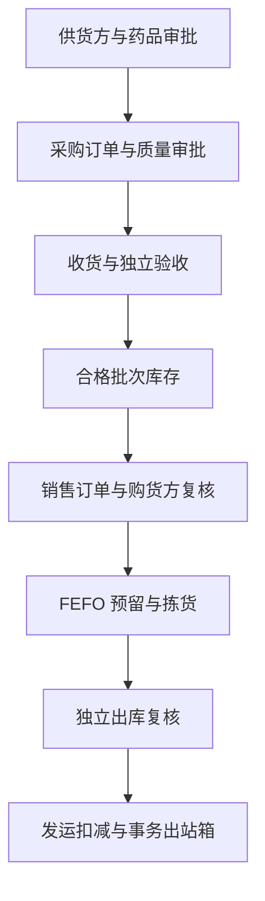

# WMS / 药品 GSP 质量管理系统

[查看 CI](https://github.com/AllenMGu/WMS/actions/workflows/ci.yml) ·
[GSP 差距矩阵](docs/GSP_GAP_ANALYSIS.md) ·
[CSV 验证计划](docs/VALIDATION_PLAN.md) ·
[目标架构](docs/ARCHITECTURE.md)

本项目正在从通用多仓库 WMS 拆分为“WMS 业务域 + GSP 质量域 + 外部集成域”的模块化系统。
旧版 Web 前端、微信小程序和 `/api` WMS 接口暂时保持兼容；新增受控业务统一位于
`/api/gsp`。

当前版本：`0.3.0`。当前定位是**可继续开发和验证的 GSP 工程基线**，尚不是可直接用于
药品经营活动的商业成品。

> 软件功能不能单独证明企业符合 GSP。正式投用还需要质量部门批准的业务流程与 SOP、
> 权限矩阵、主数据、培训、风险评估、计算机化系统验证、备份恢复演练和持续变更控制。

## 实施状态

| 阶段 | 范围 | 状态 |
| --- | --- | --- |
| 第一阶段 | 应用拆分、环境配置、LDAP 权限收敛、质量主数据、批次、审计、出站箱 | 已完成 |
| 第二阶段 | 采购制单、质量审批、按单收货、独立验收、合格数量入批次库存 | 已完成 |
| 第三阶段 | 销售审批、购货方复核、FEFO 预留、拣货、独立出库复核、发运扣减 | 已完成 |
| 后续阶段 | 退货、召回、养护、承运商、在途/签收、温湿度、电子签名、CSV 文件包 | 待实施 |

未完成项及建议优先级见 [GSP 差距矩阵](docs/GSP_GAP_ANALYSIS.md)。

## 已实现的受控闭环



### 质量与主数据

- 供货方、购货方资质审批、暂停与有效期控制。
- 药品质量主数据、药品批次、批号库存和质量锁定。
- 批号、生产日期、有效期、追溯码和冷链温度信息校验。
- 停用用户代替物理删除，保留历史记录中的操作人引用。

### 采购与收货

- 采购制单、提交和质量审批状态机。
- 收货必须关联已批准采购订单，防止无单收货。
- 收货人员与验收人员岗位分离。
- 只有验收合格数量进入批次库存；验收结果进入审计链和事务出站箱。

### 销售与发运

- 销售订单提交后执行购货方资质和药品经营范围复核。
- 按近效期先出（FEFO）跨批号分配，数据库行锁降低并发重复占用风险。
- 库存不足时整体失败，不保留部分预留；订单取消时释放预留。
- 分配、出库复核、发运三个节点重复校验资质、有效期、追溯信息和质量锁定。
- 拣货/发运准备人与出库复核人岗位分离。
- 发运时原子扣减现存量和预留量，并写入 `SHIPMENT_CONFIRMED` 出站事件。

### 审计与集成

- 关键操作必须填写变更原因，并写入可验证的哈希链审计事件。
- 九州通等外部系统通过事务出站箱对接，避免直接修改库存核心表。
- 提供批号追溯、审计链校验和合规概览接口。

## 系统结构

```text
WMS/
├── app/
│   ├── application.py               # 应用装配入口
│   ├── legacy.py                    # 兼容期通用 WMS，后续继续拆分
│   ├── core/                        # 配置、数据库和共享基础设施
│   └── gsp/
│       ├── models.py                # 质量主数据、批次、库存、审计、出站箱
│       ├── procurement_receiving/   # 采购、收货、验收闭环
│       ├── sales_shipping/          # 销售、FEFO、复核、发运闭环
│       ├── rules.py                 # 可独立评审和验证的质量规则
│       ├── router.py                # GSP 主数据与合规 API
│       └── schemas.py               # API 数据契约
├── frontend/                        # 兼容期 Web 前端
├── wechat-miniprogram/              # 兼容期微信小程序
├── tests/                           # 自动化测试
├── docs/                            # 架构、差距、验证、九州通对接说明
├── migrations/                      # Alembic 数据库迁移
├── scripts/                         # 运维脚本
└── main.py                          # Uvicorn 兼容入口
```

## 快速开始

要求：Python 3.10 或 3.12。生产环境使用 PostgreSQL；SQLite 仅供本地开发和规则验证。

```bash
git clone https://github.com/AllenMGu/WMS.git
cd WMS
python -m venv .venv
source .venv/bin/activate
pip install -e '.[dev]'
cp .env.example .env
set -a && source .env && set +a
alembic upgrade head
uvicorn main:app --host 0.0.0.0 --port 8000
```

Windows PowerShell 激活虚拟环境：

```powershell
.venv\Scripts\Activate.ps1
```

启动后可访问：

- OpenAPI 文档：`http://localhost:8000/docs`
- 健康检查：`GET http://localhost:8000/health`

### 本地 SQLite

```bash
export DATABASE_URL='sqlite+pysqlite:///./wms-dev.db'
export AUTO_CREATE_SCHEMA=true
uvicorn main:app --reload
```

### 生产环境最低配置

生产环境必须：

- 设置 `APP_ENV=production`。
- 使用至少 32 字符的随机 `SECRET_KEY`。
- 使用 PostgreSQL `DATABASE_URL`，禁止使用 SQLite。
- 设置 `AUTO_CREATE_SCHEMA=false`。
- 通过经过评审的 Alembic 迁移变更数据库结构。
- 明确设置 `ALLOWED_ORIGINS` 和 LDAP 连接参数，禁止沿用开发默认值。

```bash
alembic upgrade head
alembic current
alembic check
```

已有旧版 WMS 数据库必须先核对结构，再按 [迁移说明](migrations/README.md) 登记旧库基线并升级；
禁止直接在生产数据库试跑迁移或回滚命令。

## 关键 API

| 业务域 | 路径示例 | 用途 |
| --- | --- | --- |
| 合规概览 | `GET /api/gsp/compliance/summary` | 汇总待审批、待复核和质量锁定状态 |
| 交易方 | `/api/gsp/partners` | 供货方/购货方建档、审批和暂停 |
| 药品与批次 | `/api/gsp/products`、`/api/gsp/batches` | 质量主数据、批次验收与放行 |
| 质量锁定 | `/api/gsp/quality-holds` | 创建和释放批次/库存质量锁定 |
| 采购 | `/api/gsp/procurement/orders` | 采购订单、提交和质量审批 |
| 收货验收 | `/api/gsp/receiving/receipts` | 按单收货与独立验收 |
| 销售 | `/api/gsp/sales/orders` | 销售订单、审批、FEFO 分配、拣货和取消 |
| 发运 | `/api/gsp/shipping/shipments` | 发运准备、独立复核和发运确认 |
| 追溯审计 | `/api/gsp/trace/batches/{batch_no}`、`/api/gsp/audit-events` | 批号追溯和审计链查询 |

完整请求/响应模型以运行时 OpenAPI 文档为准。

## 测试与质量门禁

```bash
ruff check app migrations main.py tests
pytest -q
python -m compileall -q app migrations main.py tests
pip check
alembic check
```

GitHub Actions 会在面向 `main` 的 Pull Request 上执行：

- Python 3.10 和 Python 3.12 静态检查、14 项自动化测试、源码编译和依赖一致性检查。
- PostgreSQL 16 服务启动、`alembic upgrade head`、`alembic check` 和集成测试。
- 官方 Actions 固定完整提交 SHA，工作流权限限制为 `contents: read`。

## 设计与实施资料

- [目标架构](docs/ARCHITECTURE.md)
- [GSP 差距矩阵](docs/GSP_GAP_ANALYSIS.md)
- [CSV / 验证计划](docs/VALIDATION_PLAN.md)
- [九州通接口边界](docs/JZT_INTEGRATION.md)
- [数据库迁移说明](migrations/README.md)

## 投用声明

正式用于药品经营或药品生产企业销售、储存、运输环节前，企业质量部门必须根据实际经营范围、
地方监管要求和批准的 URS 对本系统进行评审、确认和验证。验证至少应覆盖需求追溯、风险评估、
权限与职责分离、数据完整性、审计追踪、备份恢复、异常处理、接口、迁移、培训和变更控制。
