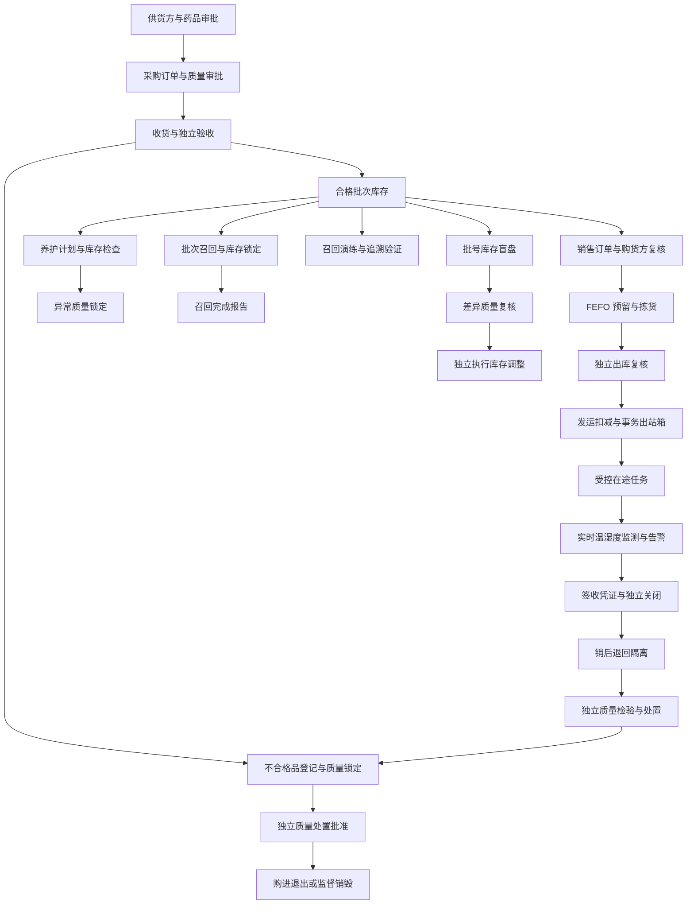

# WMS / 药品 GSP 质量管理系统

[查看 CI](https://github.com/AllenMGu/WMS/actions/workflows/ci.yml) ·
[GSP 差距矩阵](docs/GSP_GAP_ANALYSIS.md) ·
[CSV 验证计划](docs/VALIDATION_PLAN.md) ·
[目标架构](docs/ARCHITECTURE.md) ·
[运维控制手册](docs/OPERATIONS_RUNBOOK.md)

本仓库是 WMS / GSP 系统的后端仓库，包含 FastAPI 服务、数据库模型与迁移、自动化测试、
运维脚本和验证设计资料。客户端已拆分为独立仓库：

- [WMS Web 前端](https://github.com/AllenMGu/WMS-frontend)
- [WMS 微信小程序](https://github.com/AllenMGu/WMS-miniprogram)

后端继续保留兼容期 `/api` WMS 接口；新增受控业务统一位于 `/api/gsp`。仓库拆分原则、
版本关系与部署边界见 [仓库拆分说明](docs/REPOSITORY_SPLIT.md)。

当前版本：`0.12.0`。当前定位是**可继续开发和验证的 GSP 工程基线**，尚不是可直接用于
药品经营活动的商业成品。

> 软件功能不能单独证明企业符合 GSP。正式投用还需要质量部门批准的业务流程与 SOP、
> 权限矩阵、主数据、培训、风险评估、计算机化系统验证、备份恢复演练和持续变更控制。

## 实施状态

| 阶段 | 范围 | 状态 |
| --- | --- | --- |
| 第一阶段 | 应用拆分、环境配置、LDAP 权限收敛、质量主数据、批次、审计、出站箱 | 已完成 |
| 第二阶段 | 采购制单、质量审批、按单收货、独立验收、合格数量入批次库存 | 已完成 |
| 第三阶段 | 销售审批、购货方复核、FEFO 预留、拣货、独立出库复核、发运扣减 | 已完成 |
| 第四阶段 | 销后退回隔离、独立质量检验、批次召回、通知和回收数量核对 | 已完成 |
| 第五阶段 | 不合格品登记、独立处置批准、监督销毁、购进退出、召回时限和进展报告 | 已完成 |
| 第六阶段 | 养护计划与异常锁定、召回演练、召回完成报告及法定时限预警 | 已完成 |
| 第七阶段 | 批号库存盲盘、差异复盘/审批、受控库存调整和并发基线保护 | 已完成 |
| 第八阶段 | GSP 岗位批准依据、职责冲突、授权复核/到期、离职回收和 LDAP 最小权限导入 | 已完成 |
| 第九阶段 | 资质证据与授权人员、NMPA 档案核验、旧批号查询关闭、抽样/受控打印、全链路锁定和审计校验 | 已完成 |
| 第十阶段 | 秘密版本治理、双人审批、备份证据/异地副本/告警、恢复演练审批与独立验证 | 已完成（软件控制） |
| 第十一阶段 | 承运商资质、受控车辆/驾驶员、运输任务、在途异常、签收凭证和独立关闭 | 已完成（软件控制） |
| 第十二阶段 | 校准设备、仓库/运输监测分配、实时温湿度采集、超限/离线告警、偏差处理和不可篡改记录 | 已完成（软件控制） |
| 第十三阶段 | 电子签名、签名含义、身份再确认、单次签署门禁和签名链验证 | 已完成（软件控制） |
| 当前阶段 | CSV 验证文件包（VP/URS/RA/FS/DS/RTM/IQ/OQ/PQ/报告/放行） | 待实施 |
| 部署验收 | 目标环境秘密管理、备份定时器、异地介质/告警和首次恢复演练 | 待完成 |
| 后续阶段 | 九州通正式适配器最后实施 | 待实施 |

其余 P0 与当前业务功能阶段完成后，下一阶段进入 CSV 验证文件包；九州通正式接口适配仍最后开展。

未完成项及建议优先级见 [GSP 差距矩阵](docs/GSP_GAP_ANALYSIS.md)。

## 已实现的受控闭环



### 质量与主数据

- 供货方、购货方许可证附件、质量协议、销售/采购授权人员独立核验；缺失或过期时实时阻断采购和销售。
- 药品质量主数据保存注册批准档案与 NMPA/企业核验引用；任何变更都撤销原批准并要求独立重新审批。
- 批号、生产日期、有效期、追溯码和冷链温度信息校验。
- 停用用户代替物理删除，保留历史记录中的操作人引用。

### 采购与收货

- 采购制单、提交和质量审批状态机。
- 收货必须关联已批准采购订单，防止无单收货。
- 收货人员与验收人员岗位分离。
- 验收前必须按批准方案登记抽样方法、数量、记录号和独立抽样人员；打印副本登记模板版本、唯一份号和用途。
- 只有验收合格数量进入批次库存；验收结果进入审计链和事务出站箱。

### 销售与发运

- 销售订单提交后执行购货方资质和药品经营范围复核。
- 按近效期先出（FEFO）跨批号分配，数据库行锁降低并发重复占用风险。
- 库存不足时整体失败，不保留部分预留；订单取消时释放预留。
- 分配、拣货、发运准备、出库复核和最终发运重复校验资质、有效期、追溯信息和质量锁定。
- 拣货/发运准备人与出库复核人岗位分离。
- 发运时原子扣减现存量和预留量，并写入 `SHIPMENT_CONFIRMED` 出站事件。

### 承运、在途与签收

- 承运商必须具备有效许可证、质量协议和按运输方式要求的独立核验文件；变更文件后自动撤销原批准。
- 车辆和驾驶员分别建档与独立批准；冷链车辆还必须具备有效校准证据。
- 发运准备仅接受已批准的承运商、车辆和驾驶员 ID，并固化路线、交接单和预计到达时间。
- 运输任务按 `PREPARED → IN_TRANSIT → DELIVERED → CLOSED` 流转；在途异常进入质量决定，高风险质量影响异常同时锁定受影响批次。
- 存在未解决异常时禁止签收；签收保存收货人、单位、包装/数量结论和凭证引用，且签收登记人不得自行关闭运输交接。
- 签收、运输关闭和关键质量决定均要求电子签名；外部签收凭证引用仍需按企业 SOP 管理原件。

### 实时温湿度监测

- 监测设备保存序列号、测量范围、精度、校准证据和有效期，登记人与质量审批人分离；重新校准后自动回到待审批状态。
- 设备按仓库库位或运输任务建立受控监测分配，质量人员独立批准温湿度告警阈值、严重阈值、采样周期和离线判定时间。
- 采集接口使用“监测分配 + 外部读数编号”实现幂等；同编号内容冲突时拒绝写入。
- 原始读数按监测分配形成 SHA-256 前向哈希链，并禁止通过 ORM 更新或删除；校验接口可定位首个断点。
- 普通超限形成待处置告警；严重超限或设备离线会自动锁定仓库库位或运输任务涉及的批次。
- 温湿度告警必须由独立质量人员记录偏差、严重告警 CAPA、决定和处置证据；未完成决定的运输告警禁止签收。
- 冷链运输任务在实际发运前必须存在已批准的实时监测分配。

### 电子签名与签署审计

- 用户先通过本地口令或 LDAP 重新确认身份，系统签发只显示一次的短时令牌；数据库仅保存令牌摘要，不保存口令。
- 签名挑战固定操作、目标记录、签名含义、理由和完整请求快照摘要，5 分钟内只能由本人使用一次。
- 关键质量审批、放行/解除、出库复核、运输签收/关闭、盘点调整及运维验证均强制校验 `X-GSP-Signature-Token`。
- 消费成功后生成不可修改、不可删除的电子签名，保存签署人账号/姓名快照、身份来源、含义、时间、来源地址和请求内容。
- 全部电子签名形成 SHA-256 前向链，可单条验签或定位签名链首个断点；签署事件同时进入通用审计链。

### 退货与召回

- 销后退货必须关联原发运单和批次分配记录，累计退回数量不得超过原发运数量。
- 退回商品先记录为待检，不直接增加可用库存；退货收货人与质量检验人必须分离。
- 只有包装、储存条件、追溯信息和批次状态均合格的数量才能回到批准库位。
- 冷链退货必须保留退回运输温度记录；拒收数量必须记录隔离、销毁或退回供货方等处置方向。
- 召回启动执行制单/审批分离，自动识别受影响的发运批次和购货方并锁定当前库存。
- 召回按一级 1 日、二级 3 日、三级 7 日计算通知期限及下一次进展报告期限，并在合规概览中统计逾期。
- 召回按目标记录通知和回收数量；关闭召回需要独立复核，且不会自动解除质量锁定。

### 不合格品与购进退出

- 收货验收拒收和销后退货拒收会自动形成不合格品记录；在库检查也可登记不合格数量并锁定批次。
- 不合格品登记人与处置批准人必须分离，最终处置仅允许退回供货方或监督销毁。
- 销毁要求独立执行人与独立见证人，并记录监督机构和销毁证明；有库存来源时原子扣减对应批号库存。
- 购进退出必须关联已批准退供的不合格品及原批次供货方，依次经过提交、质量批准和仓库发运。
- 处置完成后质量锁定仍需独立复核解除，避免处置一部分后自动放开同批次剩余库存。

### 药品养护与召回准备度

- 养护计划以企业批准的 SOP 周期和重点品种规则为输入，不在代码中擅自固定养护频次。
- 养护计划经过提交和独立质量审批，逐条记录外观、包装、储存条件、温湿度及下次养护日期。
- 发现异常时立即建立 `MAINTENANCE_ABNORMAL` 质量锁定，并同步锁定该批次全部库存；完成计划需由检查人之外的质量人员复核。
- 召回演练从真实已发运批号生成购货方追溯目标，但不锁库存、不发送真实召回通知；未定位目标或超时必须记录偏差与 CAPA。
- 召回关闭后生成10个工作日完成报告期限，报告保存处理总结、有效性评价和监管报送引用；当前工作日计算排除周末，生产投用前必须接入企业批准的法定节假日工作日历。

### 批号库存盘点

- 盘点范围以批号库存记录为最小单位，支持全盘、循环盘点和抽盘；质量批准时固化账面数量、预留数量与并发版本。
- 实盘阶段对盘点人员隐藏账面数量和差异，差异必须记录原因；盘点批准人与实盘人员分离。
- 质量复核可要求差异复盘或批准调整；实盘、差异批准和调整执行三项职责必须由不同人员承担。
- 调整执行前再次核对库存数量和 `lock_version`，盘点期间发生库存交易时禁止按过期基线自动调账。
- 实盘数量低于已预留销售数量时禁止调整，必须先处理销售预留和偏差；完成后写入审计链和九州通事务出站箱。

### 审计与集成

- 关键操作必须填写变更原因，并写入可验证的哈希链审计事件。
- LDAP 配置和仍保留的旧扫码、盘点、入库、出库动作进入同一审计链；GSP 药品从旧库存、流水、盘点和入出库查询/报表中排除。
- 审计链校验结果保存检查事件数量、结果、断点和证据引用；可由外部计划任务定期执行：`python scripts/verify-audit-chain.py --actor-user-id <ID> --evidence-ref <REF>`。
- 九州通等外部系统通过事务出站箱对接，避免直接修改库存核心表。
- 提供批号追溯、审计链校验和合规概览接口。

### 秘密、备份与恢复治理

- 生产启动要求声明外部秘密管理来源及 JWT、数据库、LDAP 凭据版本引用；系统不保存秘密正文。
- 秘密轮换经过申请、独立质量审批、管理员实施和独立结果验证；审批人与实施人分离，申请/实施人不得自行验证。
- 备份证据保存计划时间、校验和、大小、主副本、异地/离线副本、保留期限和失败告警引用，并要求独立复核。
- 恢复演练只能选用已复核通过的成功备份，经过申请、独立审批、隔离库执行及独立验证，记录 RTO/RPO 和核对证据。
- `scripts/backup-postgres.sh` 生成自校验 PostgreSQL 自定义格式备份、异地副本和 JSON 证据；失败时写入耐久告警标记。
- `scripts/restore-drill-postgres.sh` 仅允许恢复到显式确认的空白非生产数据库，并执行关键表数量与审计链只读检查。
- systemd 参考调度和生产配置清单见 [运维控制手册](docs/OPERATIONS_RUNBOOK.md)。

## 系统结构

```text
WMS/
├── app/
│   ├── application.py               # 应用装配入口
│   ├── legacy.py                    # 兼容期通用 WMS，后续继续拆分
│   ├── core/                        # 配置、数据库和共享基础设施
│   └── gsp/
│       ├── models.py                # 质量主数据、批次、库存、审计、出站箱
│       ├── environment/             # 校准设备、监测分配、不可变读数与告警偏差
│       ├── procurement_receiving/   # 采购、收货、验收闭环
│       ├── quality_disposition/      # 不合格品处置、监督销毁与购进退出
│       ├── maintenance/              # 养护计划、检查、异常锁定与完成复核
│       ├── operations/               # 秘密轮换、备份证据和恢复演练治理
│       ├── sales_shipping/          # 销售、FEFO、复核、发运闭环
│       ├── stocktaking/             # 批号库存盲盘、差异复核与受控调整
│       ├── transport/               # 承运商资质、在途异常、签收与关闭
│       ├── returns_recalls/          # 销后退货、检验、召回与回收核对
│       ├── rules.py                 # 可独立评审和验证的质量规则
│       ├── router.py                # GSP 主数据与合规 API
│       └── schemas.py               # API 数据契约
├── tests/                           # 自动化测试
├── docs/                            # 架构、差距、验证、九州通对接说明
├── migrations/                      # Alembic 数据库迁移
├── scripts/                         # 运维脚本
└── main.py                          # Uvicorn 兼容入口
```

## 后端快速开始

要求：Python 3.12。生产环境使用 PostgreSQL；SQLite 仅供本地开发和规则验证。

```bash
git clone https://github.com/AllenMGu/WMS.git
cd WMS
python -m venv .venv
source .venv/bin/activate
pip install -e '.[dev]'
cp .env.example .env
set -a && source .env && set +a
alembic upgrade head
uvicorn main:app --host 0.0.0.0 --port 8000
```

Windows PowerShell 激活虚拟环境：

```powershell
.venv\Scripts\Activate.ps1
```

启动后可访问：

- OpenAPI 文档：`http://localhost:8000/docs`
- 健康检查：`GET http://localhost:8000/health`

### 本地 SQLite

```bash
export DATABASE_URL='sqlite+pysqlite:///./wms-dev.db'
export AUTO_CREATE_SCHEMA=true
uvicorn main:app --reload
```

### 生产环境最低配置

生产环境必须：

- 设置 `APP_ENV=production`。
- 使用至少 32 字符的随机 `SECRET_KEY`。
- 由外部秘密管理服务注入秘密，并设置 `SECRETS_PROVIDER`、`SECRET_KEY_VERSION_REF` 和
  `DATABASE_CREDENTIAL_VERSION_REF`；配置 LDAP 服务账号时还必须设置 `LDAP_CREDENTIAL_VERSION_REF`。
- 使用 PostgreSQL `DATABASE_URL`，禁止使用 SQLite。
- 设置 `AUTO_CREATE_SCHEMA=false`。
- 通过经过评审的 Alembic 迁移变更数据库结构。
- 明确设置 `ALLOWED_ORIGINS` 和 LDAP 连接参数，禁止沿用开发默认值。

```bash
alembic upgrade head
alembic current
alembic check
```

已有旧版 WMS 数据库必须先核对结构，再按 [迁移说明](migrations/README.md) 登记旧库基线并升级；
禁止直接在生产数据库试跑迁移或回滚命令。

## 关键 API

| 业务域 | 路径示例 | 用途 |
| --- | --- | --- |
| 合规概览 | `GET /api/gsp/compliance/summary` | 汇总待审批、待复核和质量锁定状态 |
| 交易方 | `/api/gsp/partners` | 供货方/购货方建档、审批和暂停 |
| 药品与批次 | `/api/gsp/products`、`/api/gsp/batches` | 质量主数据、批次验收与放行 |
| 质量锁定 | `/api/gsp/quality-holds` | 创建和释放批次/库存质量锁定 |
| 采购 | `/api/gsp/procurement/orders` | 采购订单、提交和质量审批 |
| 收货验收 | `/api/gsp/receiving/receipts` | 按单收货与独立验收 |
| 不合格品 | `/api/gsp/quality/nonconforming` | 登记、独立处置批准和监督销毁 |
| 购进退出 | `/api/gsp/procurement/returns` | 关联不合格品、质量批准和退供发运 |
| 销售 | `/api/gsp/sales/orders` | 销售订单、审批、FEFO 分配、拣货和取消 |
| 发运 | `/api/gsp/shipping/shipments` | 发运准备、独立复核和发运确认 |
| 承运与在途 | `/api/gsp/transport/carriers`、`/api/gsp/transport/tasks` | 资质准入、运输任务、异常决定、签收凭证和独立关闭 |
| 温湿度监测 | `/api/gsp/environment/devices`、`/api/gsp/environment/assignments`、`/api/gsp/environment/alarms` | 设备校准、监测分配、实时读数、超限/离线告警和质量决定 |
| 电子签名 | `/api/gsp/electronic-signatures/challenges`、`/api/gsp/electronic-signatures` | 身份再确认、签名策略、单次签署、签名查询和完整性验证 |
| 销后退货 | `/api/gsp/returns/sales` | 原发运关联、隔离收货、独立检验和回库/拒收 |
| 药品召回 | `/api/gsp/recalls` | 批次召回、库存锁定、购货方通知、回收数量和关闭复核 |
| 召回演练 | `/api/gsp/recall-drills` | 真实发运链路追溯演练、偏差与 CAPA 记录 |
| 药品养护 | `/api/gsp/maintenance/plans` | 养护计划、独立审批、库存检查、异常锁定和完成复核 |
| 批号库存盘点 | `/api/gsp/stocktaking/plans` | 盲盘、复盘、差异质量批准和独立库存调整 |
| 追溯审计 | `/api/gsp/trace/batches/{batch_no}`、`/api/gsp/audit-events` | 批号追溯和审计链查询 |
| 秘密轮换 | `/api/gsp/operations/secret-rotations` | 版本引用、独立审批、实施与验证，不接收秘密正文 |
| 备份证据 | `/api/gsp/operations/backups` | 备份结果、异地/离线副本、告警与独立复核 |
| 恢复演练 | `/api/gsp/operations/recovery-drills` | 恢复计划、审批、RTO/RPO、执行与独立验证 |

完整请求/响应模型以运行时 OpenAPI 文档为准。

## 测试与质量门禁

```bash
ruff check app migrations main.py scripts tests
pytest -q
python -m compileall -q app migrations main.py tests
pip check
alembic check
```

GitHub Actions 会在面向 `main` 的 Pull Request 上执行：

- Python 3.12 静态检查、37 项自动化测试、源码编译和依赖一致性检查。
- PostgreSQL 16 服务启动、`alembic upgrade head`、`alembic check` 和集成测试。
- 官方 Actions 固定完整提交 SHA，工作流权限限制为 `contents: read`。

## 设计与实施资料

- [目标架构](docs/ARCHITECTURE.md)
- [仓库拆分说明](docs/REPOSITORY_SPLIT.md)
- [GSP 差距矩阵](docs/GSP_GAP_ANALYSIS.md)
- [CSV / 验证计划](docs/VALIDATION_PLAN.md)
- [九州通接口边界](docs/JZT_INTEGRATION.md)
- [秘密、备份与恢复运维控制手册](docs/OPERATIONS_RUNBOOK.md)
- [数据库迁移说明](migrations/README.md)

## 投用声明

正式用于药品经营或药品生产企业销售、储存、运输环节前，企业质量部门必须根据实际经营范围、
地方监管要求和批准的 URS 对本系统进行评审、确认和验证。验证至少应覆盖需求追溯、风险评估、
权限与职责分离、数据完整性、审计追踪、备份恢复、异常处理、接口、迁移、培训和变更控制。
