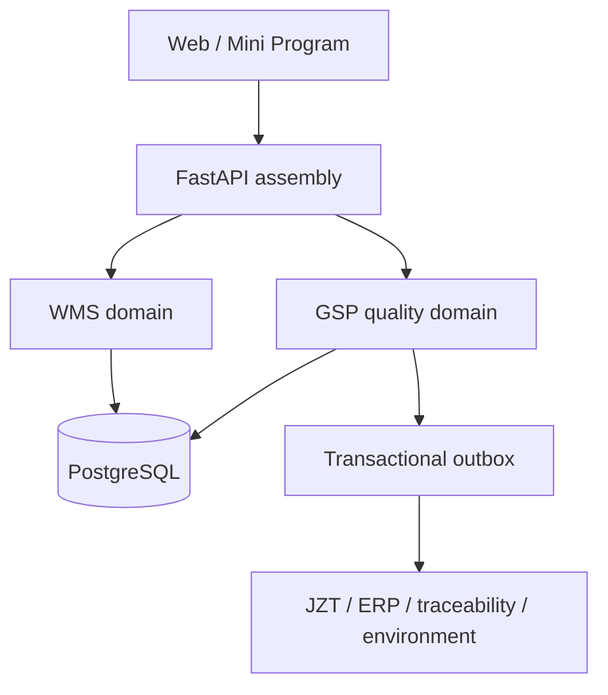

# Target Architecture

[中文](ARCHITECTURE.md) | [English](ARCHITECTURE.en.md)

## Design Principles

1. The **WMS domain** owns warehouses, locations, general goods, and generic operations; it does not decide whether a
   pharmaceutical product may be traded or released.
2. The **GSP quality domain** owns quality master data, qualification approval, batch release, quality holds, expiry
   rules, and traceability controls.
3. The **integration domain** connects ERP, JZT, environmental systems, and regulatory traceability platforms through
   transactional outbox records, deterministic idempotency, retry, and reconciliation.
4. Quality rules should be deterministic and reviewable so that approved OQ/PQ evidence can be repeated.
5. Controlled data is not physically deleted; changes retain identity, authority, reason, time, and before/after values.

## Code Boundaries

| Boundary | Location | Responsibility |
|---|---|---|
| Application assembly | `app/application.py` | API assembly, liveness, readiness, middleware |
| Core infrastructure | `app/core/` | Configuration, database, time and common services |
| GSP domain | `app/gsp/` | Controlled quality workflows and shared controls |
| Procurement/receipt | `app/gsp/procurement_receiving/` | Approval, receipt, sampling and acceptance |
| Sales/shipping | `app/gsp/sales_shipping/` | Qualification, FEFO, packing, review and shipment |
| Returns/recalls | `app/gsp/returns_recalls/` | Quarantine, inspection, recall and recovery reconciliation |
| Quality disposition | `app/gsp/quality_disposition/` | Holds, disposition, destruction and purchase returns |
| Maintenance/expiry | `app/gsp/maintenance/` | Maintenance plans, expiry policy, review and automatic control |
| Stocktaking | `app/gsp/stocktaking/` | Selection, blind count, freeze, variance and adjustment |
| Transport | `app/gsp/transport/` | Carrier, vehicle/driver, transit exception and delivery evidence |
| Environment | `app/gsp/environment/` | Device approval, assignments, readings, alarms and deviations |
| Electronic signature | `app/gsp/electronic_signature/` | Reauthentication, one-time challenges and signature chain |
| Operational compliance | `app/gsp/operations/` | Secret rotation, backup evidence and restore exercises |
| Compatibility WMS | `app/legacy.py` | Transitional legacy API; further decomposition remains desirable |
| JZT adapter | planned `app/integrations/jzt/` | Explicitly excluded until formal specifications are available |

## Data Ownership

| Data | System of record | Rule |
|---|---|---|
| General warehouse/location data | WMS domain | May be referenced by GSP controls |
| Pharmaceutical product and partner approval | GSP domain | Unapproved or expired records block business |
| Batch quantity and status | GSP batch stock | Legacy non-batch stock is not authoritative for GSP items |
| Holds, expiry alerts, recalls and signatures | GSP domain | Append-only history and independent decisions are retained |
| JZT message state | Integration domain | Never becomes the source of truth for stock |

## Security and Integrity

- Production secrets are externally injected and tracked only by non-secret version references.
- LDAP supports mutually exclusive LDAPS, StartTLS on port 389, or explicitly approved plain port 389. Plain
  authentication is disabled by default and reported as a readiness warning when enabled.
- Login failures are persisted by account and source IP.
- Audit, electronic-signature, and environmental-reading chains use PostgreSQL transactional serialization to prevent
  concurrent forks.
- Readiness checks the database, expected Alembic revision, and relevant operational warnings.

## Controlled State Models

Major workflows use explicit state transitions and independent decision points:

- procurement: draft → quality approved → received → sampled → accepted/rejected → batch stock;
- generic manual batch creation, manual batch acceptance, and direct batch-stock receipt routes are disabled;
  authoritative batch stock can arise only from controlled receipt acceptance, inspected sales returns, or an
  approved stocktake adjustment;
- sales: draft → quality approved → reserved → picked → packed → independently reviewed → shipped;
- transport: approved assignment → dispatched → in transit → delivered → independently closed;
- returns: received in quarantine → inspected → returned to stock/rejected;
- recalls: draft → approved/active → notifications and recovery updates → reconciled → independently closed;
- maintenance: planned → approved → checked → exception resolution → independently completed;
- stocktaking: selected/frozen → blind count → variance review/CAPA → approved adjustment → closed;
- nonconforming stock: held → independent disposition approval → return/destruction → witness evidence → closed.

Before the final active hold on a batch is released, the system revalidates supplier evidence, product approval,
batch release and traceability, and the configured stop-sale shelf-life threshold. Stock remains `HOLD` if any
blocking finding remains.

Critical approvals consume a short-lived, single-use electronic-signature challenge bound to the operation, record,
meaning, and request digest. Closing an environmental alarm never automatically releases its quality hold.

## External Boundaries

The internal environmental and outbox controls are implemented, but the following remain outside this baseline:

1. physical temperature/humidity gateway and external notification-channel integration;
2. production JZT adapter, authentication, mapping, inbound receipts, reconciliation, and joint testing;
3. the complete approved CSV validation package and production release evidence.
