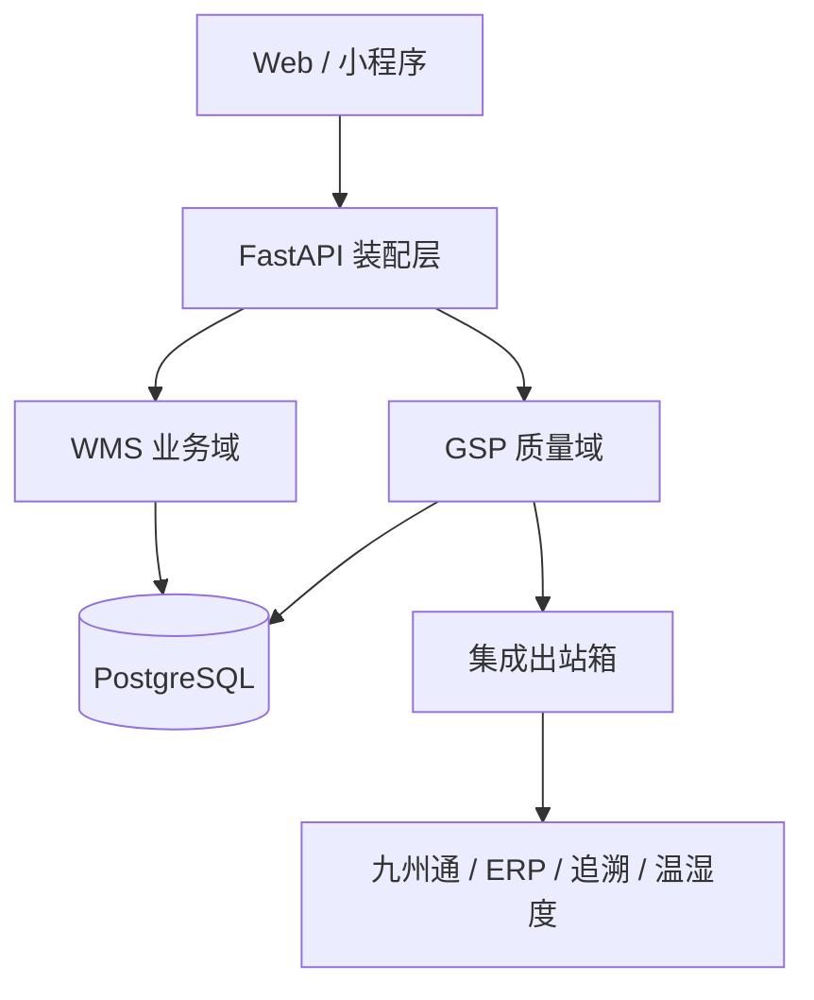
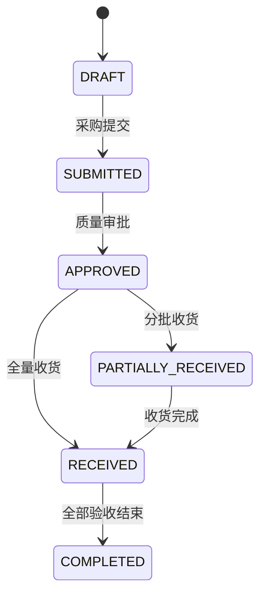

# 目标架构

## 拆分原则

1. **WMS 业务域**负责仓库、库位、基础货物和通用作业，不自行决定药品能否经营或放行。
2. **GSP 质量域**拥有质量主数据、资质审批、批次放行、质量锁定、近效期和追溯规则。
3. **集成域**通过出站箱、幂等键和对账记录连接 ERP、九州通、温湿度系统及监管追溯平台。
4. 质量规则以纯函数表达，便于质量部门评审，也便于形成 OQ/PQ 可重复证据。
5. 受控数据不物理删除；更改需要身份、权限、原因、时间以及前后值审计。

## 当前代码边界

| 边界 | 当前文件 | 状态 |
|---|---|---|
| 应用装配 | `app/application.py` | 已独立 |
| 配置与数据库 | `app/core/` | 已独立 |
| GSP 质量域 | `app/gsp/` | 已建立第一版 |
| 采购/收货闭环 | `app/gsp/procurement_receiving/` | 已独立，覆盖订单审批、收货与验收 |
| 通用 WMS | `app/legacy.py` | 兼容运行，仍需继续拆分 |
| Web 前端 | `frontend/` | 仅覆盖旧 WMS |
| 九州通适配器 | 计划为 `app/integrations/jzt/` | 等正式接口规范 |

## WMS 后续拆分顺序

1. `identity`：用户、LDAP、仓库授权。
2. `catalog`：仓库、库位、货物基础信息。
3. `inventory`：库存余额、库存流水、并发锁。
4. `receiving`：采购订单、收货、验收、入库。
5. `shipping`：销售订单、拣货、出库复核、运输。
6. `stocktaking`：盘点计划、差异审批、库存调整。

每次抽取只迁移一个业务闭环，并以原 API 回归测试保护现有前端，避免一次性重写。

## 数据所有权

| 数据 | 权威来源 | 其他模块的使用方式 |
|---|---|---|
| 仓库/库位 | WMS | GSP 仅引用 ID |
| 药品质量属性 | GSP | WMS 不得直接修改 |
| 批次放行/质量锁定 | GSP | 入出库必须同步检查 |
| 批号库存 | GSP | 通用库存只能作为汇总视图 |
| 九州通报文状态 | 集成域 | 不反向成为库存事实来源 |
| 审计事件 | GSP/审计服务 | 只追加，不提供更新或删除 API |

## 受控采购与收货状态

收货数量先记录在 `gsp_receipt_items`，不直接形成可用库存。验收人与收货人必须不同；
只有验收合格数量才写入 `gsp_batch_stock`，拒收数量不进入可用库存。
