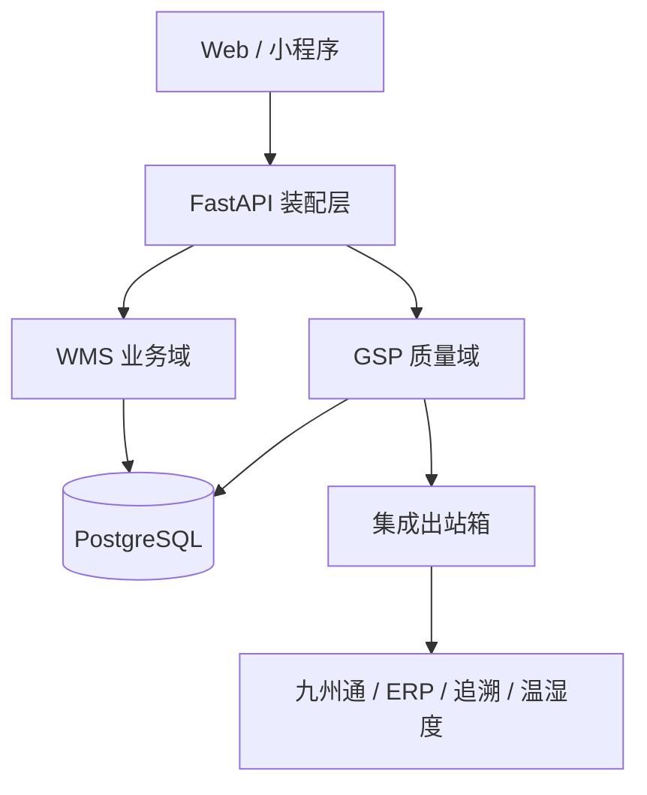
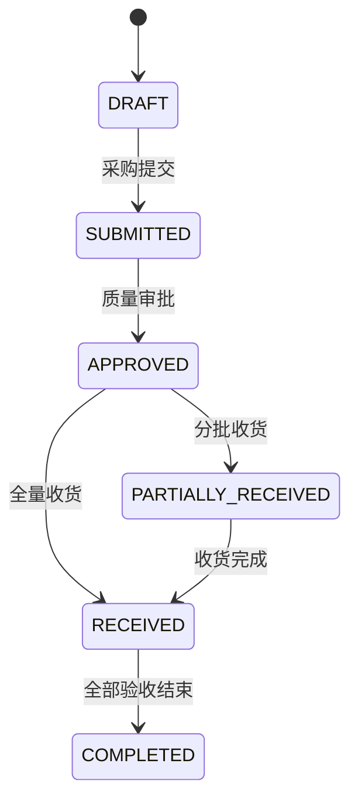
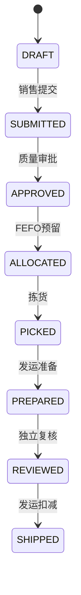
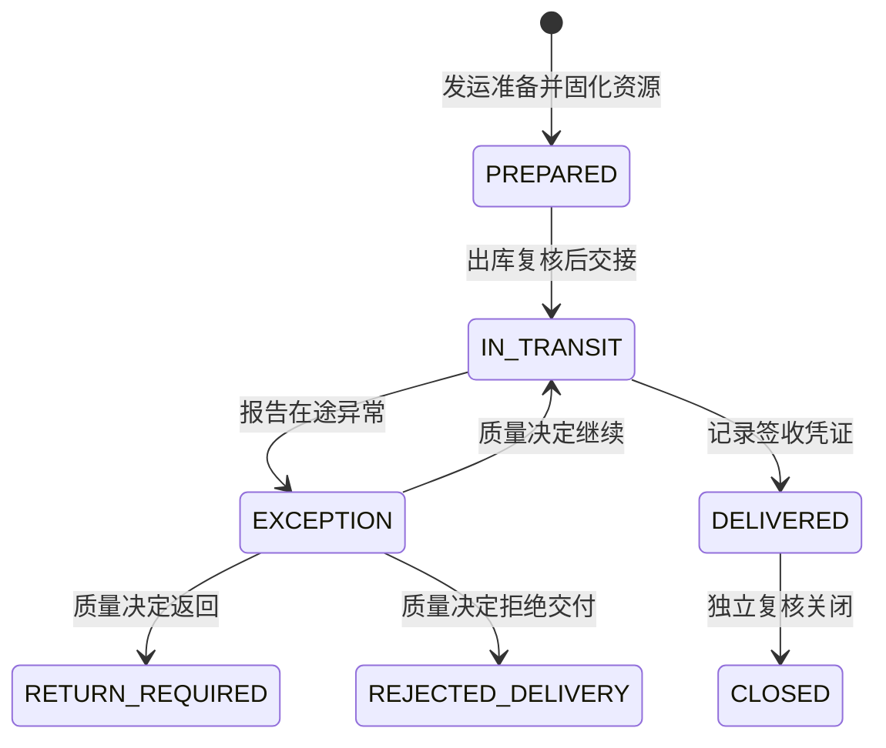
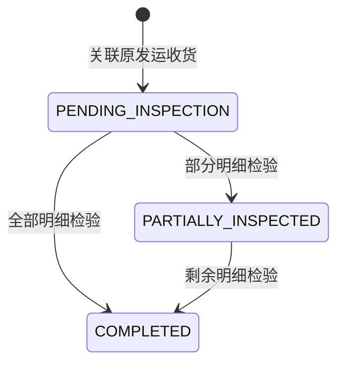
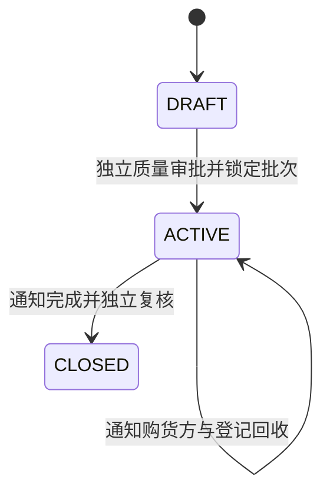
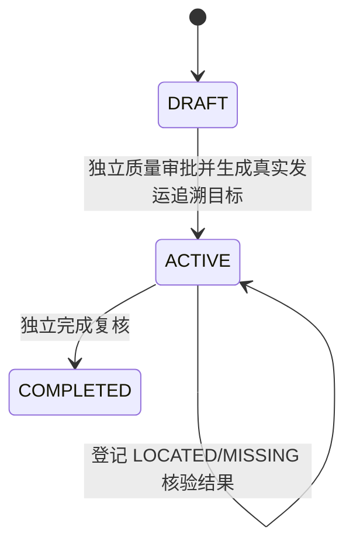
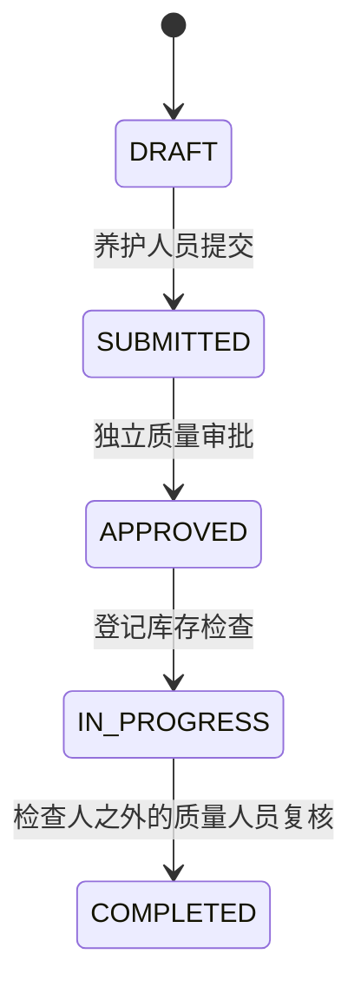
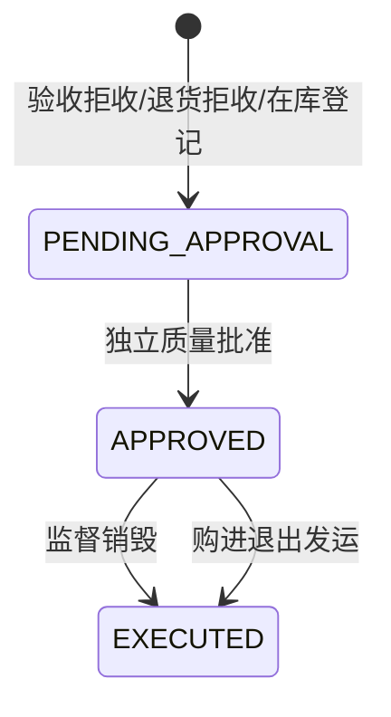
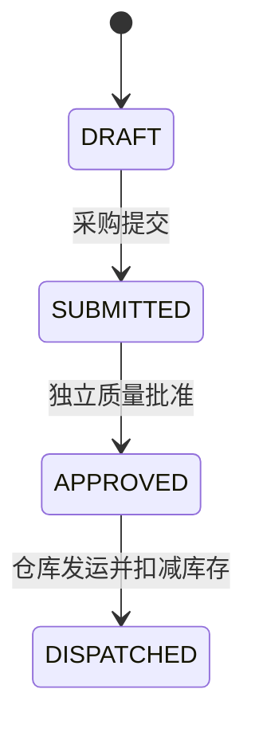

# 目标架构

## 拆分原则

1. **WMS 业务域**负责仓库、库位、基础货物和通用作业，不自行决定药品能否经营或放行。
2. **GSP 质量域**拥有质量主数据、资质审批、批次放行、质量锁定、近效期和追溯规则。
3. **集成域**通过出站箱、幂等键和对账记录连接 ERP、九州通、温湿度系统及监管追溯平台。
4. 质量规则以纯函数表达，便于质量部门评审，也便于形成 OQ/PQ 可重复证据。
5. 受控数据不物理删除；更改需要身份、权限、原因、时间以及前后值审计。

## 当前代码边界

| 边界 | 当前文件 | 状态 |
|---|---|---|
| 应用装配 | `app/application.py` | 已独立 |
| 配置与数据库 | `app/core/` | 已独立 |
| GSP 质量域 | `app/gsp/` | 已建立第一版 |
| 批号库存盘点 | `app/gsp/stocktaking/` | 已独立，覆盖盲盘、差异审批与受控调整 |
| 采购/收货闭环 | `app/gsp/procurement_receiving/` | 已独立，覆盖订单审批、收货与验收 |
| 销售/出库闭环 | `app/gsp/sales_shipping/` | 已独立，覆盖资质复核、FEFO、拣货、复核与发运 |
| 退货/召回闭环 | `app/gsp/returns_recalls/` | 已独立，覆盖销后退回隔离、质量检验、批次召回与回收核对 |
| 不合格品/购进退出 | `app/gsp/quality_disposition/` | 已独立，覆盖质量锁定、独立处置批准、监督销毁与退供发运 |
| 药品养护 | `app/gsp/maintenance/` | 已独立，覆盖计划、审批、逐库存检查、异常锁定与完成复核 |
| 运维合规 | `app/gsp/operations/` | 已独立，覆盖秘密轮换、备份证据、恢复演练和职责分离 |
| 承运与在途 | `app/gsp/transport/` | 已独立，覆盖承运资质、在途异常、签收凭证与独立关闭 |
| 通用 WMS | `app/legacy.py` | 兼容运行，仍需继续拆分 |
| Web 前端 | [`AllenMGu/WMS-frontend`](https://github.com/AllenMGu/WMS-frontend) | 独立部署，当前仅覆盖兼容期旧 WMS |
| 微信小程序 | [`AllenMGu/WMS-miniprogram`](https://github.com/AllenMGu/WMS-miniprogram) | 原生微信客户端，独立发布 |
| 九州通适配器 | 计划为 `app/integrations/jzt/` | 等正式接口规范 |

## WMS 后续拆分顺序

1. `identity`：用户、LDAP、仓库授权。
2. `catalog`：仓库、库位、货物基础信息。
3. `inventory`：库存余额、库存流水、并发锁。
4. `receiving`：采购订单、收货、验收、入库。
5. `shipping`：销售订单、拣货、出库复核、运输。
6. `stocktaking`：盘点计划、差异审批、库存调整。

每次抽取只迁移一个业务闭环，并以原 API 回归测试保护现有前端，避免一次性重写。

## 数据所有权

| 数据 | 权威来源 | 其他模块的使用方式 |
|---|---|---|
| 仓库/库位 | WMS | GSP 仅引用 ID |
| 药品质量属性 | GSP | WMS 不得直接修改 |
| 批次放行/质量锁定 | GSP | 入出库必须同步检查 |
| 批号库存 | GSP | 通用库存只能作为汇总视图 |
| 九州通报文状态 | 集成域 | 不反向成为库存事实来源 |
| 审计事件 | GSP/审计服务 | 只追加，不提供更新或删除 API |
| 秘密正文 | 外部秘密管理服务 | 本系统只保存提供方、版本和批准/验证证据引用 |
| 备份文件 | 生产备份及异地/离线介质 | 数据库只保存校验和、位置、保留期和复核证据引用 |
| 承运商/车辆/驾驶员资质 | GSP 运输域 | 发运只能引用当时有效且已批准的记录 |
| 运输任务与签收凭证 | GSP 运输域 | 发运单保留承运资源快照，任务保存完整交接状态 |

## 秘密与灾难恢复控制

秘密轮换采用 `SUBMITTED → APPROVED → PENDING_VERIFICATION → VERIFIED/FAILED` 状态机。
申请人不能审批，审批人不能实施，申请人和实施人不能验证；API 契约禁止额外字段，避免把秘密正文
误传入证据库。

备份作业生成 PostgreSQL 自定义格式文件、SHA-256 校验和、独立异地副本和 JSON 证据。恢复演练只能
使用已独立复核为 `ACCEPTED` 的成功备份，并采用 `SUBMITTED → APPROVED → EXECUTED → VERIFIED`
状态机保存 RTO、RPO、隔离目标和关键记录核对结果。实际调度、介质和告警连接属于部署环境控制，
配置边界见 `docs/OPERATIONS_RUNBOOK.md`。

## 受控采购与收货状态

收货数量先记录在 `gsp_receipt_items`，不直接形成可用库存。验收人与收货人必须不同；
只有验收合格数量才写入 `gsp_batch_stock`，拒收数量不进入可用库存。

## 受控销售与发运状态

`gsp_batch_stock.reserved_quantity` 防止并发订单重复占用同一库存。质量锁定、资质失效、
批次过期或剩余有效期不足会在分配、出库复核和实际发运三个节点重复阻断。

## 受控运输与签收状态

发运准备时实时校验承运商必备文件、服务范围、车辆资质/冷链校准和驾驶员授权；
实际发运前再次校验。高风险且有质量影响的在途异常会建立批次质量锁定，在质量人员
完成偏差/CAPA 决定前不得签收。签收登记人与关闭复核人必须分离。实时温湿度和电子签名
仍属于后续独立边界。

## 销后退货状态

退回数量在质量检验前不进入可用库存。合格数量需要确认包装、储存条件、追溯信息、质量锁定和
批准库位；拒收数量不直接形成库存，并自动进入不合格品处置流程。

## 药品召回状态

召回启动时从已发运批次生成购货方目标并建立独立质量锁定。系统按一级 1 日、二级 3 日、
三级 7 日计算通知和进展报告期限，并保存每次进展报告。召回关闭只结束召回业务状态，
不自动解除质量锁定；后续处置或重新放行必须走质量锁定解除流程。关闭后生成10个工作日完成
报告期限，并保存处理总结、有效性评价和监管报送引用。当前期限算法排除周末，生产投用前需要
接入企业批准的法定节假日工作日历。

## 召回演练状态

演练复用真实批号、发运单与购货方关系，但不建立质量锁定、不生成真实召回通知。存在未定位目标
或超过企业设定时限时，完成记录必须包含偏差说明与 CAPA 引用，结果标记为 `FAILED`。

## 药品养护状态

计划周期、重点品种和下次养护日期由企业批准的 SOP 决定。每条检查保存外观、包装、储存条件、
温湿度和发现；异常结果立即创建质量锁定并锁定同批次全部库存。

## 不合格品处置状态

在库不合格品登记会建立独立质量锁定；拒收但从未入库的数量只保留受控记录，不虚增库存。
销毁要求批准、执行、见证岗位分离和监督证明；退供按原批次供货方生成购进退出单。

## 购进退出状态

